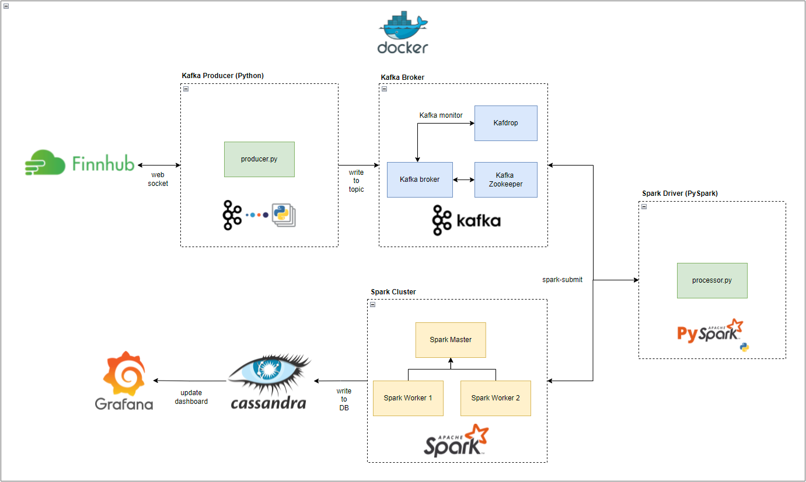
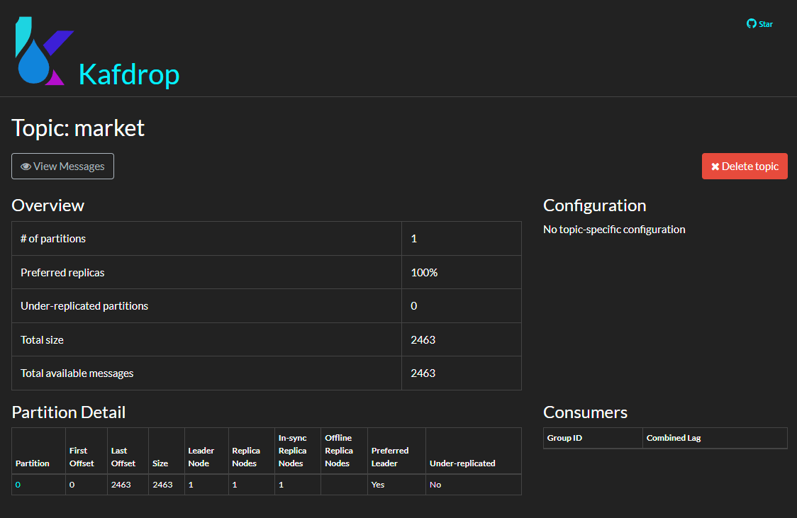
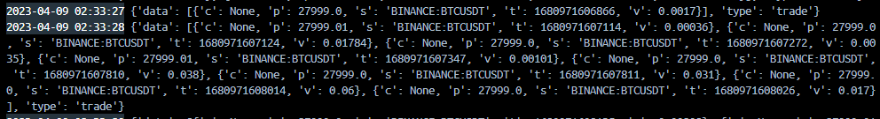
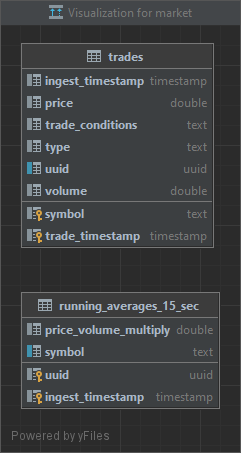
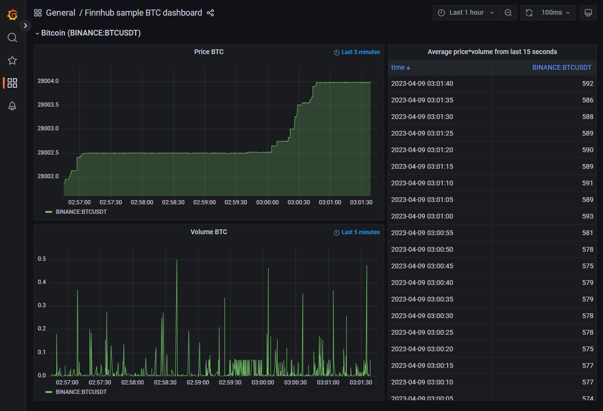

# Real Time Stock Tracker Pipeline
Ce projet est un pipeline de streaming de données pour les données de marché boursier Finnhub utilisant Kafka, Spark et Cassandra. Ce projet est destiné à présenter la mise en place d'un pipeline de streaming de données de bout en bout conteneurisé et hautement évolutif.

Merci à l'utilisateur GitHub RSKriegs pour l'inspiration sur l'architecture de la solution et la source de données pour ce projet personnel. Vous pouvez trouver leur implémentation originale de ce projet ici : [!https://github.com/RSKriegs/finnhub-streaming-data-pipeline].
Je vais approfondir la raison des technologies utilisées, en passant en revue le fonctionnement de haut niveau de chaque framework utilisé, ainsi que la stratégie de containerisation.

---

### **Watermark: Imad Elmanser**

# La pile technologique
- Python 3.7
- Apache Kafka
- Apache Spark
- Cassandra DB
- Grafana

---

# Architecture de la solution

---

# L'objectif
La source de données pour ce projet est Finnhub, et nous allons construire un tableau de bord en temps réel pour suivre les prix et volumes de Bitcoin : USD. Pour acheminer les données de la source amont (websocket Finnhub) vers l'application du tableau de bord que nous construisons, nous aurons besoin d'un pipeline robuste au milieu pour gérer les entrées et sorties. C'est ici que Kafka interviendra en tant que courtier de messages, et un cluster Spark autonome fournira la puissance de traitement pour transformer et écrire ces données dans la base de données Cassandra. Il est important de noter que pour ce projet de démonstration, chaque composant sera dockerisé et l'ensemble de la pile pourra être exécuté localement avec `docker compose up --build -d`. Un CI/CD approprié devrait être mis en place à l'aide de l'orchestration Kubernetes. Avec un léger refactoring du code, nous pouvons facilement configurer cela pour qu'il fonctionne à distance sur EKS/ECS avec une meilleure redondance.

---

## Configuration initiale

### Cluster Kafka
Kafka est un système de messagerie distribué qui permet aux producteurs d'écrire des données dans des sujets et aux consommateurs de lire des données à partir de ces sujets. Les producteurs et les consommateurs dans Kafka sont des applications clientes qui utilisent l'API Kafka pour interagir avec le cluster Kafka. Globalement, les API du producteur et du consommateur Kafka fournissent un moyen puissant et flexible d'écrire et de lire des données à partir des sujets Kafka. Ces API permettent aux développeurs de créer des applications hautement évolutives et tolérantes aux pannes qui peuvent traiter et analyser de grandes quantités de données en temps réel.

Notre cluster Kafka sera exécuté sur Docker, et les configurations des conteneurs peuvent être trouvées dans le fichier `docker-compose.yaml` à la racine du répertoire :
- Conteneur Zookeeper : Un service de coordination distribué utilisé par Apache Kafka pour gérer et maintenir le cluster Kafka. ZooKeeper aide Kafka à accomplir plusieurs tâches importantes, telles que l'élection de leaders, l'enregistrement des courtiers et la gestion des membres du cluster.
- Conteneur Broker : Un broker est un serveur responsable de la gestion d'une portion des partitions de sujet Kafka. Les brokers stockent les partitions de sujet, reçoivent des messages des producteurs et livrent des messages aux consommateurs. Les brokers maintiennent également des informations de métadonnées sur les partitions de sujet, telles que le nombre de partitions, le facteur de réplication et l'emplacement des répliques de partition.
- Conteneur Kafdrop : Un outil open-source basé sur le web pour surveiller les clusters Apache Kafka. Il offre une interface web conviviale pour visualiser les sujets Kafka, les partitions, les messages et les groupes de consommateurs, et permet de surveiller l'activité en temps réel de votre cluster Kafka.

---

## Producteur
Nous commencerons par écrire un service Python long-running qui s'abonne au sujet de trading Bitcoin de Binance sur le point de terminaison WS de Finnhub. Cette application productrice utilise `websocket` et `kafka-python` pour lire les messages en temps réel via le websocket et encode chaque réponse JSON au format binaire AVRO. Chaque message est envoyé au courtier Kafka que nous avons configuré dans le fichier Docker Compose ci-dessus. Étant donné que nous utilisons Kafka uniquement en tant que bus de messages, nous sommes principalement intéressés par l'envoi de ces points de données de ticker à un seul sujet pour pouvoir les consommer de manière asynchrone dans un cluster Spark séparé.

---

## Test Consumer
Ceci est quelque chose que j'ai ajouté à des fins de test pour valider que le cluster Kafka était correctement configuré et que l'application productrice tirait correctement les données du websocket et les envoyait au sujet Kafka. Cela m'a certainement aidé à déboguer les problèmes de formatage liés aux conversions AVRO avant de rédiger l'application de traitement Spark.

Voici un exemple de sortie console de l'application de test consumer qui lisait depuis Kafka, décodait AVRO et imprimait le contenu à la console :

---

## Base de données Cassandra
La base de données choisie pour ce projet est Cassandra DB. Cassandra est connue pour être très résiliente et évolutive. Cassandra est optimisée pour les données temporelles, et si nous pouvons exploiter correctement les UUIDs basés sur le temps, nous pouvons améliorer considérablement les performances à grande échelle.

Notre instance Cassandra a un seul keyspace appelé `market`, dans lequel se trouvent deux tables sur lesquelles notre cluster Spark écrit :
* Table de faits atomiques : `trades` - stocke les points de données de ticker individuels
* Table de vue agrégée : `running_averages_15_sec` - Moyenne mobile des prix x volume dans une fenêtre glissante de 15 secondes.

---

## Spark Processor (Consumer)
Nous utiliserons un cluster Spark autonome (Docker) avec un nœud maître et deux nœuds travailleurs pour traiter les messages Kafka et écrire nos données nettoyées dans Cassandra. L'image Docker `StreamProcessor` est utilisée pour soumettre une application `Pyspark` au cluster Spark via la commande `spark-submit`, et injecte surtout les dépendances des connecteurs `kafka` et `cassandra` pour assurer que le cluster Spark puisse se connecter au courtier Kafka ainsi qu'à la base de données Cassandra que nous avons configurée. Il est important de s'assurer que les versions des dépendances correspondent en fonction des versions de Python et Spark utilisées dans le cluster Spark et le driver, sinon vous rencontrerez des erreurs Spark obscures. Notez le format de dépendance `<groupId>`:`<artifactId>`:`<version>` dans l'exemple `spark-submit` ci-dessous, qui est la commande finale exécutée pour l'image Docker `StreamProcessor` :

`spark-submit --master spark://spark-master:7077 --packages org.apache.spark:spark-sql-kafka-0-10_2.12:3.2.1,org.apache.spark:spark-avro_2.12:3.2.1,com.datastax.spark:spark-cassandra-connector_2.12:3.2.0 src/main.py`

---

## Tableau de bord Grafana
Grafana est une plateforme open-source de visualisation de données et de surveillance. Elle vous permet de créer des tableaux de bord qui affichent des données en temps réel provenant de diverses sources, telles que des bases de données et des API. Avec Grafana, nous pouvons visualiser nos données de marché boursier de différentes manières, notamment des graphiques, des courbes et des tableaux. Cela en fait une solution à faible code pour nous afin de visualiser nos données de prix (graphique en courbes), de volume (graphique en courbes) et de prix x volume (tableau).

Nous exécutons Grafana dans une image Docker qui est configurée pour lire depuis nos tables Cassandra DB `trades` et `running_averages_15_sec`.

Grafana vous permet de personnaliser vos visualisations avec diverses options, telles que l'ajout d'annotations, de seuils et d'alertes. Cela permet de surveiller facilement les données boursières pour des événements spécifiques, tels que des changements de prix ou des pics de volume.

---

## Améliorations et conclusions
* Le suivi des logs dans les clusters Spark peut être difficile. Il serait intéressant de mettre en place un suivi robuste des logs en segmentant les différents niveaux de logs et en utilisant un outil de surveillance tiers pour accéder plus facilement à ces logs et déboguer les erreurs qui ne sont pas facilement détectées en parcourant les logs bruts dans chaque instance Docker.
* Nettoyer CI/CD et utiliser Kubernetes pour orchestrer les conteneurs Docker.
* Intégrer la surveillance Grafana en version gratuite pour les serveurs Kafka et Kubernetes.
* Ajouter plusieurs tickers boursiers et ajouter plus de vues agrégées telles que des comparaisons horaires ou la détection d'anomalies.

---

**Watermark: Imad Elmanser**
